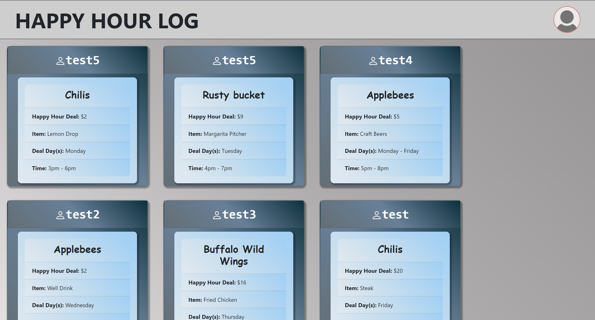
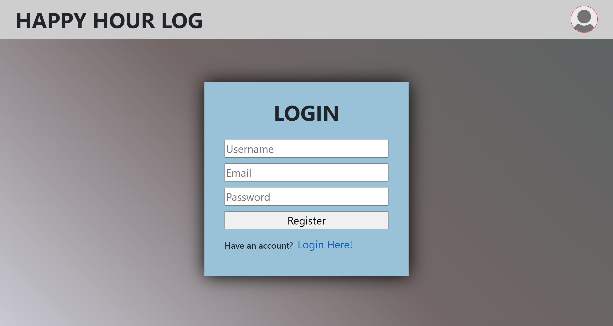
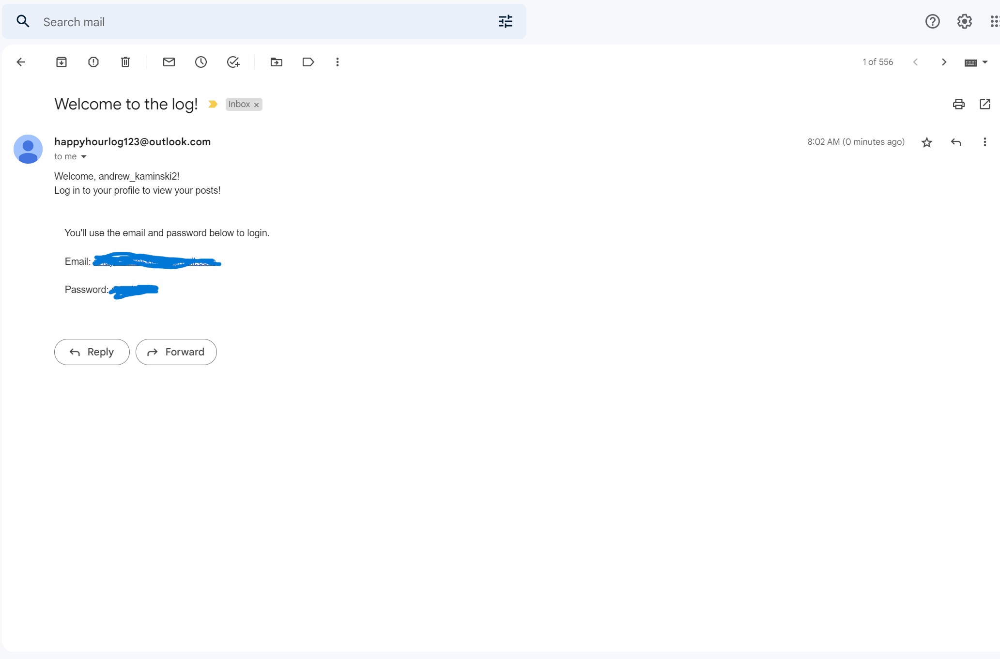
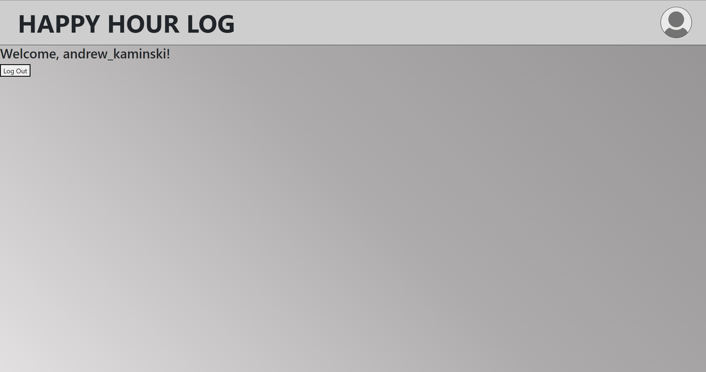
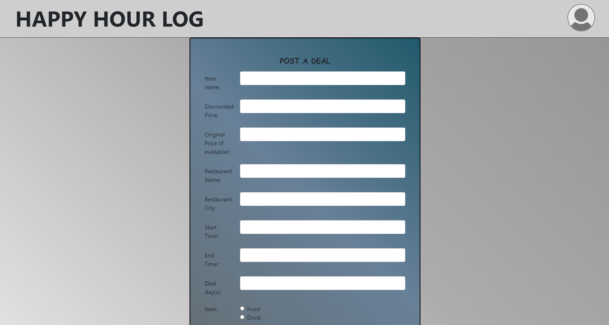
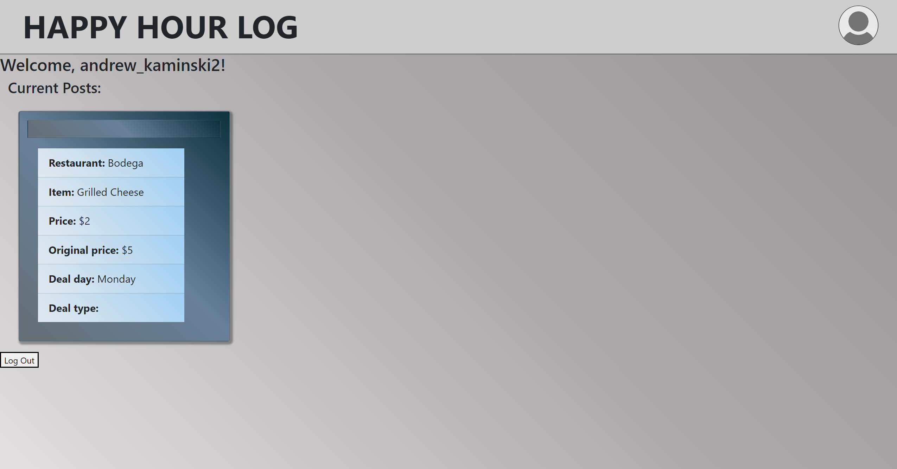

# Happy Hour Log Repo

  

## Description

  This application uses used Node.js, Express.js, Handlebars, Sequelize, and deployed using Heroku to run an application to view and post happy hour deals. The application allows users to register and log in to the application. Upon registration, a welcome email will be sent to the new user. Logged in users can then post and view their happy hour deals they have seen and that others have seen.

  ## Table of Contents

  - [Installation](#installation)
  - [Usage](#usage)
  - [Contributing](#contributing)
  - [License](#license)
  - [Tests](#tests)
  - [Future-Development](#future-development)

  ## Installation

  To install this project, download the files from our repository at https://github.com/clbutl/project-2-repo. Run an NPM install in the console to load in the correct packages, open mysql and run a 'SOURCE db/schema.sql' to initialize the database (after creating a .env file and entering your necessary data), exit sql and run an 'npm run seed' to load in any seed data, and finally do an npm start to start the application and begin entering data! Navigate to the local site at http://localhost:3001 to view the homewebpage.

  You can also visit the deployed webpage via the following link: https://possessed-pirate-93340.herokuapp.com/

  ## Usage
  On the main homepage you can view other people's posts. Note you the icon is highlighted red in the top left corner becuase you aren't logged in. Click that to log in/ register.

  

  Registration will ask you for your login credentials and upon completion will send you a confirmation email.

  
  

  You will be taken to your profile page where you can view posts logged specifically by you. In the current example there isn't any logged posts. We can add one by accessing the dropdown menu and choosing to post. Also, note the top right icon isn't red anymore, meaning you're logged in.

  

  On the post form, fill out all lines about the happy hour deal and click submit. This will redirect you to the main page where you can see your post! You can also view this on your profile page as well.

  
  

  ## Contributing

  - [Edna Omadjambe](https://github.com/Edna1999)
  - [Cannon Butler](https://github.com/clbutl)
  - [Andrew Kaminski](https://github.com/AndrewKamSki)

  ## License
  The License being used is: MIT
  If you would like to read more on this please click the badge to navigate to the license page: 
  

  ## Tests

  No tests have been created yet for this project
  
  ## Future-Development

  We had limited time to complete this project, but some enhancements in the future are listed below:
  - Upload Image to Profile
  - Upvoting and Downvoting Items
  - Filtering Content
  - Sorting content on homepage/profile page
  - A ‘Recent Posts’ page
  - Links to restaurant menus
  - Make each deal post look like an individual, unique flyer instead of cards